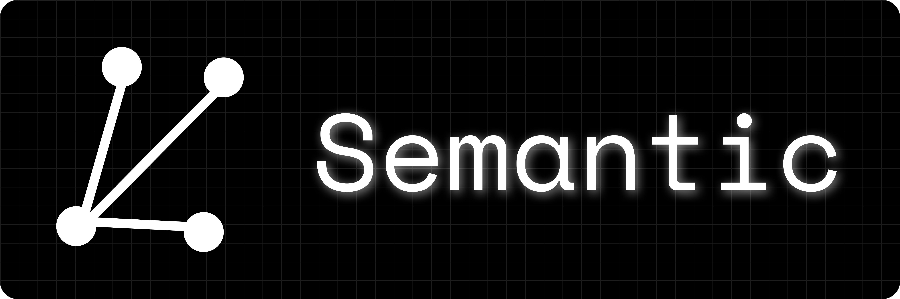

# Semantic: A document management and querying system that uses Semantic Search

<p align="center">


Semantic is made to end tab hoarding and efficiently search for documents and images _(planned to implement)_ when needed.

The approach is similar to [TagStudio](https://github.com/TagStudioDev/TagStudio) but also uses semantic search for querying.

> [!CAUTION]
> This is far from being a complete application. So far this is just a side project with lot of broken code.

## Contents

- [Development](#Development)
- [Todos](#Todos)

## Development

- Clone this repo and cd into it:

```bash
git clone https://github.com/mdhvg/semantic.git
cd semantic
```

- Install node modules:

```bash
npm i
```

- Create python environment (optional, but recommended) and install python depencencies:

```bash
cd backend
```

```bash
python -m venv .env
source ./.env/bin/activate
```

```bash
pip install -r ../resources/common/requirements.txt
```

- Run the client application in development mode:

```bash
npm run dev
```

- Start the python server (In a separate terminal after activating the environment):

```bash
cd backend
python main.py
```

## TODOs

- [ ] Replace entire REST API backend-frontend communication system with Socket based communication.

- [x] Fix order of backend setup. The backend should perform checks in the following order:

  - Embedded python files
  - Python environment setup

  All checks are to be performed on the first startup of the app only.

- [x] Implement Windows python backend setup using [Windows Embeddable python package](https://www.python.org/ftp/python/3.11.9/python-3.11.9-embed-amd64.zip) and [get-pip.py](https://github.com/pypa/get-pip)

  - Command for downloading get-pip.py `curl -sSL https://bootstrap.pypa.io/get-pip.py -o get-pip.py`

- [ ] Change the [`setup/setup.js`](setup/setup.js) to use Electron build location.

- [ ] The Miniforge install on Linux creates a `.conda/condarc` file in `$HOME` directory which could interfare with user's conda environments. Change the Miniforge config so it creates the `.conda/condarc` file in the installation directory only.

- [ ] To make sure all files of embedded python binary are successfully downloaded, compare their hashes too.

- [ ] Move the python version, download links, etc to a separate config file.

- [ ] Set an electron persistent variable using [Electron-store](https://github.com/sindresorhus/electron-store) to avoid recreation of backend environment.

- [ ] Implement a function that selectively installs only the missing python dependencies

- [x] Make textContent and displayContent separate fields textContent will contain the text content of the document displayContent will contain the content of the document in HTML format. This will allow the user to view the document in as html and also allow for better search indexing by the model.

- [x] Replace TipTap with [ByteMD](https://github.com/bytedance/bytemd) or [codemirror](https://codemirror.net) (Preferably) -- Replaced with [remark](https://github.com/remarkjs/remark)

- [ ] Implement server status bar on the frontend.

- [ ] Since supporting markdown and HTML with same source simultaneously is a hassle, separate them and make a new field which represents which kind of data the text represents. (can call the field mime, then maybe support multiple formats in the future) And now, content is split into 2 fields:

  - Plaintext (Required) : Textual representation of whatever is in the document.
  - DisplayText (Optional) : Textual representation of display code. Takes value of `Plaintext` if null
  - MimeType (Required) [Only supports markdown and html for now] : Type of the document. This will be used to call the appropriate display function for the DisplayText

- [ ] Implement editing text using buttons (like Bold, Italic, etc) in the editor

- [ ] Enable keybind support

- [ ] Remove developer setup script and replace with development instructions.
