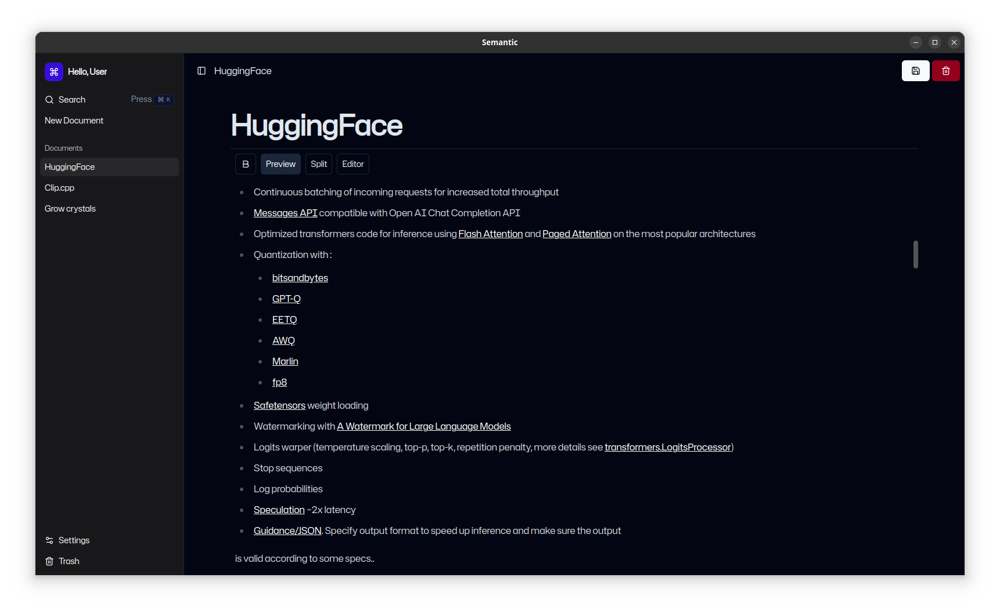

# Semantic

_A document management and querying system that uses Semantic Search_

<p align="center">


Semantic is made to end tab hoarding and efficiently search for documents and images _(planned to implement)_ when needed.

The approach is similar to [TagStudio](https://github.com/TagStudioDev/TagStudio) but also uses semantic search for querying.

> This is still work in progress btw...



## Contents

- [Development](#Development)
- [Todos](#Todos)

## Development (current preferred mode for running)

### For semantic client

- Clone this repo and change directory into it:

```bash
git clone https://github.com/mdhvg/semantic.git
cd semantic
```

- Install node modules:

```bash
npm i
```

### For semantic server

- Clone the semantic server (in a separate directory)

```bash
git clone https://github.com/mdhvg/semantic-server.git
cd semantic-server
```

- Create python environment (optional, but recommended) and install python depencencies:

```bash
python -m venv .env
source .env/bin/activate
```

```bash
pip install -r requirements.txt
```

- (From client Directory) Run the client application in development mode:

```bash
npm run dev
```

- (From the server Directory) Start the python server (In a separate terminal after activating the environment):

```bash
python main.py
```

## TODOs

- [ ] Replace entire python backend with a C++ backend using [llama.cpp](https://github.com/ggerganov/llama.cpp).
- [x] Fix order of backend setup. The backend should perform checks in the following order:

  - Embedded python files
  - Python environment setup

  All checks are to be performed on the first startup of the app only.

- [x] Implement Windows python backend setup using [Windows Embeddable python package](https://www.python.org/ftp/python/3.11.9/python-3.11.9-embed-amd64.zip) and [get-pip.py](https://github.com/pypa/get-pip)

  - Command for downloading get-pip.py `curl -sSL https://bootstrap.pypa.io/get-pip.py -o get-pip.py`

- [ ] To make sure all files of embedded python binary are successfully downloaded, compare their hashes too.

- [ ] Move the python version, download links, etc to a separate config file.

- [ ] Set an electron persistent variable using [Electron-store](https://github.com/sindresorhus/electron-store) to avoid recreation of backend environment.

- [ ] Implement server status bar on the frontend.

- [ ] Implement editing text using buttons (like Bold, Italic, etc) in the editor

- [ ] Enable keybind support
